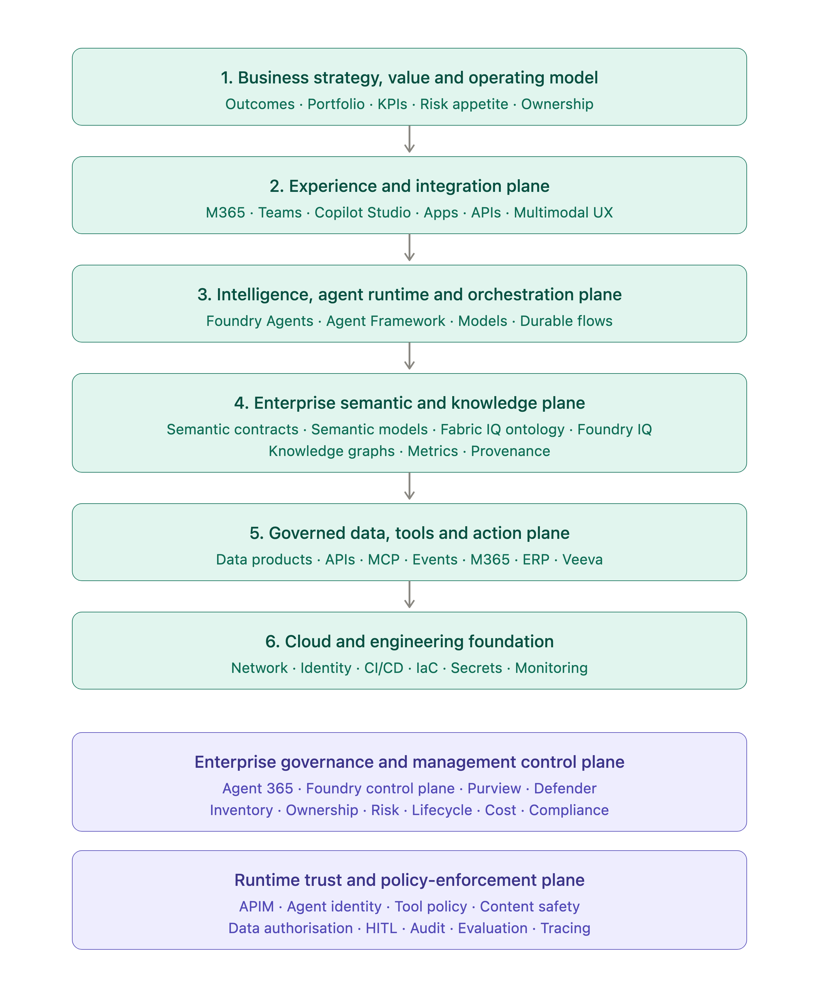

<article class="longform-article" markdown="1">

# The Enterprise AI North Star: Own the Meaning, Govern the Intelligence, Let Platforms Implement

## Why semantic contracts, ontologies, knowledge graphs and AI control planes are becoming foundational to enterprise AI

Most enterprise AI strategies begin with the wrong question.

They ask:

* Which model should we standardise on?
* Which agent framework should we adopt?
* Should we use Microsoft, Google, AWS or an independent platform?
* How quickly can we deploy copilots across the organisation?

These are important implementation questions. But they are not the questions that should define an enterprise AI North Star.

Models will change. Agent frameworks will mature. Platforms will converge, fragment, rebrand and sometimes disappear. The technologies selected today are unlikely to remain unchanged for the lifetime of the business.

An enterprise AI North Star must therefore be more durable than any particular model or platform.

It should describe how the organisation turns its data, knowledge, policies and operational capabilities into **trusted, reusable and governable intelligence**.

That requires more than an AI platform. It requires an operating architecture connecting:

* Business strategy and measurable outcomes
* Human experiences and decision-making
* AI models, agents and orchestration
* Shared business semantics and enterprise knowledge
* Data products and operational systems
* Identity, security, risk and policy enforcement
* Evaluation, observability and lifecycle management

The central argument of this article is:

> **The enterprise should own the meaning. Platforms should provide the implementation.**

Microsoft Fabric, Microsoft Foundry and the wider Azure ecosystem provide an increasingly comprehensive example of how such an architecture might be implemented. However, Microsoft—or any other technology provider—should not become the sole owner of the organisation’s business meaning.

That distinction may become one of the most important enterprise architecture decisions of the agentic AI era.

---

# The real barrier to enterprise AI is not access to models

Most large organisations can already access powerful language models.

They can build a proof of concept, connect a chatbot to documents and demonstrate an agent calling an API.

The more difficult problem appears when the organisation attempts to scale from a handful of experiments to hundreds of AI applications and agents.

At that point, recurring questions emerge:

* What does *customer* mean across different divisions?
* Which definition of revenue is authoritative?
* Is an order considered complete when it is submitted, dispatched or invoiced?
* Which source contains the approved risk classification?
* Can an agent change a customer record, or only recommend a change?
* Who approved the agent’s access?
* What happens when the source schema changes?
* How do we know whether the agent’s answer remains accurate after deployment?
* Which team owns the consequences of an automated action?

Without shared answers, every AI team creates its own miniature interpretation of the enterprise.

Business definitions are embedded in prompts. Metrics are recreated inside individual applications. Access rules are implemented differently by each project. Retrieval pipelines contain undocumented assumptions. Agent tools expose operational systems without consistent action controls.

The organisation does not merely develop technical debt. It develops **semantic debt** and **governance debt**.

The result is a collection of intelligent applications that cannot reliably agree on what the business means or what they are authorised to do.

This is why enterprise AI architecture must begin below the model layer.

---

# The North Star is a governed intelligence architecture

An AI North Star should not be interpreted as one central application or one enormous AI platform.

It is better understood as a set of enduring architectural principles and capabilities that allow the organisation to:

1. Express business meaning consistently.
2. Connect that meaning to authoritative data.
3. Make it available to people, applications and agents.
4. Control how AI systems use it.
5. Govern what those systems are permitted to do.
6. Observe and evaluate their behaviour continuously.
7. Replace implementation technologies without losing the organisation’s institutional knowledge.

This does not mean that every enterprise needs the same architecture.

A global pharmaceutical company, a bank, a media organisation and a small digital retailer will have different:

* Regulatory obligations
* Data architectures
* Risk tolerances
* Legacy systems
* Cloud strategies
* Operating models
* Investment capacity
* Levels of AI maturity

One organisation may centralise heavily on Microsoft Fabric. Another may operate across several clouds and data platforms. A third may require an independent knowledge-graph platform. A fourth may begin with a carefully governed set of Power BI semantic models and APIs.

The implementation varies.

The enduring requirement is that business meaning, data authority, decision rights and AI governance are explicitly designed rather than accidentally distributed across prompts, code and vendor products.

---

# Untangling the semantic vocabulary

Several related terms are frequently used interchangeably in enterprise AI discussions:

* Semantic model
* Ontology
* Knowledge graph
* Semantic layer
* Data contract
* Semantic contract

They overlap, but they are not equivalent.

Understanding their differences is essential because each addresses a different architectural concern.

## Semantic model

A semantic model provides a business-friendly analytical representation of data.

It commonly defines:

* Facts and dimensions
* Measures and calculations
* Relationships
* Hierarchies
* Aggregation behaviour
* Business terminology
* Analytical security

A Power BI semantic model, for example, is designed to provide a curated analytical domain containing measures, dimensions, relationships and business-friendly terminology. It is principally optimised for reporting and interactive analysis.

A semantic model may tell us how to calculate *monthly recurring revenue* or how sales should be aggregated by product and region.

It does not necessarily provide a complete operational representation of the business.

## Ontology

An ontology describes the concepts that exist within a domain and the formal relationships between them.

It may define:

* Entity types
* Properties
* Relationships
* Cardinality
* Classification hierarchies
* Constraints
* Logical implications
* Shared vocabulary

For example:

```text
Customer places Order
Order contains Product
Product belongs to ProductCategory
Order is fulfilled by Shipment
Shipment is monitored by Sensor
```

Ontology standards such as RDF and OWL provide formal mechanisms for representing semantic relationships, while SHACL provides a standard language for validating RDF graphs against structural constraints.

An ontology is not simply a graphical database schema. Its purpose is to describe what concepts mean, not merely where their data is stored.

## Knowledge graph

A knowledge graph combines a conceptual model with actual facts or instances.

The ontology may define:

```text
Shipment belongsTo Customer
```

The knowledge graph contains:

```text
Shipment-456 belongsTo Customer-123
```

A knowledge graph therefore provides connected, queryable knowledge about real entities and their relationships.

It may be physically materialised in a graph database, but it does not have to be. Ontology-based data-access approaches can provide a virtual semantic view over existing relational sources, translating conceptual queries into queries against the underlying systems.

Microsoft Fabric Ontology follows a related pattern by allowing data to be bound into a semantic layer without necessarily copying the source data into a new store.

## Semantic layer

The semantic layer is the runtime abstraction through which consumers access trusted business meaning.

It may expose:

* Metrics
* Entities
* Relationships
* Business vocabulary
* Query logic
* Constraints
* Provenance
* Authorised views

The semantic layer can serve dashboards, analysts, applications, APIs and AI agents.

A semantic model or ontology may form part of the semantic layer, but the semantic layer is the broader consumption and execution capability.

## Data contract

A data contract defines the agreement between a data producer and its consumers.

It normally addresses matters such as:

* Schema
* Data types
* Ownership
* Quality requirements
* Availability
* Freshness
* Service-level expectations
* Classification
* Compatibility
* Deprecation

The Open Data Contract Standard, for example, defines a platform-neutral YAML structure for representing data-contract information.

A data contract answers questions such as:

> What data is being provided, under what guarantees, by whom and in what format?

## Semantic contract

A semantic contract should answer a broader question:

> What does this business concept mean, how is it connected to authoritative information, and under what conditions may people, applications or agents use it?

There is currently no single widely adopted standard that unifies ontology, metrics, data quality, policy, operational actions and AI permissions into one complete semantic-contract specification. Existing standards address different portions of the problem: W3C standards cover semantic representation and constraints; data-contract standards describe datasets; OpenAPI and AsyncAPI describe service interfaces; and MCP standardises how AI applications connect to tools and contextual resources.

Therefore, **semantic contract** is used here as an emerging architectural pattern rather than the name of a settled industry standard.

A practical semantic contract might include:

* Business identity and vocabulary
* Entity and relationship definitions
* Metrics and calculation rules
* Units and temporal meaning
* Constraints and invariants
* Source provenance
* Data-quality expectations
* Authorised uses
* Action definitions
* Approval requirements
* Version and compatibility information

This is one of the areas where enterprise practice is evolving faster than formal standardisation.

---

# Why generative AI makes semantic engineering more important

It is tempting to assume that sufficiently capable language models will remove the need for carefully designed semantic layers.

After all, an LLM can inspect a schema, interpret column names and generate a plausible query.

But language fluency is not the same as institutional authority.

A model may infer that:

```text
cust_id means customer identifier
```

It cannot independently determine:

* Whether the identifier represents an individual, household or corporate account
* Whether inactive customers should be included
* Which legal entity owns the relationship
* Which system is authoritative
* Whether a particular calculation is approved by Finance
* Whether the requesting user is authorised to see it

A language model predicts a likely interpretation. An enterprise requires an approved interpretation.

This distinction becomes more important when AI systems move from answering questions to taking actions.

An incorrect answer may misinform a user.

An incorrect action may:

* Change a customer record
* Trigger a payment
* Cancel an order
* Expose sensitive information
* Modify production infrastructure
* Create a legal or regulatory obligation

AI workloads are probabilistic and can behave differently according to input, retrieved context, tool responses and model configuration. Microsoft’s current Well-Architected guidance treats this non-determinism as a defining architectural characteristic of AI workloads rather than an implementation detail.

The answer is not to remove AI autonomy entirely.

It is to surround probabilistic reasoning with deterministic structures:

* Authoritative semantics
* Typed tool interfaces
* Identity controls
* Policy enforcement
* Data constraints
* Approval workflows
* Evaluation thresholds
* Audit trails
* Bounded action permissions

The semantic layer tells the agent what the enterprise means.

The control plane determines what the agent is allowed to do.

---

# A reference architecture for enterprise intelligence

The following model is a proposed reference architecture rather than an official industry standard.

It separates the enterprise AI environment into several logical planes.



*A proposed reference architecture for governed enterprise intelligence.*

## The business strategy and value layer

AI architecture must begin with business outcomes.

A technically advanced AI platform can still fail if the organisation cannot answer:

* Which decisions are we improving?
* Which business outcomes should change?
* What is the expected value?
* Which risks are acceptable?
* Who owns adoption?
* How will success be measured?

The North Star is not “deploy 100 agents.”

It may be:

* Reduce time to resolve customer incidents
* Improve clinical-document processing accuracy
* Shorten product-development cycles
* Reduce revenue leakage
* Improve regulatory compliance
* Increase employee productivity without increasing operational risk

The architecture exists to support those outcomes.

## The experience plane

The experience plane is where people and systems interact with enterprise intelligence.

It includes:

* Conversational interfaces
* Search experiences
* Embedded copilots
* Decision-support applications
* Automated processes
* Dashboards
* Notifications
* Human approval interfaces
* Feedback and correction mechanisms

The experience plane should expose uncertainty, evidence and action consequences appropriately.

A customer-service assistant and a compliance-review agent may use the same semantic foundation, but their experiences, permissions and accountability models will be very different.

## The intelligence and orchestration plane

This layer contains:

* Foundation models
* Specialist models
* Agent runtimes
* Prompt and context management
* Retrieval
* Planning
* Memory
* Tool routing
* Multi-agent coordination
* Deterministic workflows
* Long-running process orchestration

This is where the AI reasons.

However, the intelligence layer should not become the authoritative location for business meaning.

Definitions such as *high-value customer*, *valid invoice* or *critical incident* should not exist only inside system prompts.

Prompts are application configuration. They are not an enterprise governance system.

## The semantic and knowledge plane

This layer provides the shared business context used by humans, analytics systems, applications and AI agents.

It may contain:

* Enterprise vocabulary
* Domain ontologies
* Metrics
* Analytical semantic models
* Knowledge graphs
* Taxonomies
* Entity resolution
* Data and semantic contracts
* Provenance
* Rules and constraints
* Action descriptions

This is the layer that allows different AI systems to reason using a common language.

It does not require one enormous central ontology.

In many enterprises, a more practical model will be **federated semantic governance**:

* Central architecture defines standards, identifiers and interoperability rules.
* Domains own their concepts and definitions.
* Enterprise-level relationships connect the domains.
* Shared contracts allow different platforms to consume the definitions.

This balances enterprise consistency with domain expertise.

## The data, integration and action plane

AI systems need more than information. They increasingly need controlled access to operational capabilities.

This layer contains:

* Lakehouses and warehouses
* Operational databases
* Search and vector indexes
* Document repositories
* Streaming platforms
* SaaS systems
* APIs
* Events
* Business services
* Workflow engines
* Agent tools

OpenAPI provides a language-independent description of HTTP interfaces, while AsyncAPI provides a machine-readable specification for message-driven interfaces. These standards can help turn operational capabilities into explicit contracts rather than undocumented agent tools.

MCP can make those tools and contextual resources discoverable to AI applications. However, MCP primarily standardises integration and invocation. It does not make the underlying enterprise ontology portable, and it does not by itself define the organisation’s business meaning.

## The platform foundation

The platform foundation provides the conventional infrastructure required to build and operate the system:

* Cloud subscriptions and accounts
* Network isolation
* Private connectivity
* Compute
* Storage
* Identity
* Secrets
* Key management
* CI/CD
* Infrastructure as code
* Container platforms
* Model gateways
* Capacity and quota management

This foundation remains essential. Agentic AI does not replace good cloud architecture.

---

# The AI control plane: governance that can execute

Policies written in a document are necessary, but they are not sufficient.

Enterprise AI requires technical mechanisms that make governance observable and enforceable during operation.

Gartner uses the term **AI Trust, Risk and Security Management**, or AI TRiSM, to describe a collection of technical capabilities for ensuring that AI systems remain trustworthy, secure and compliant through monitoring, validation and enforcement.

The terminology is useful, although AI TRiSM should not be treated as a single product.

NIST’s AI Risk Management Framework organises AI risk activity around the functions Govern, Map, Measure and Manage. ISO/IEC 42001 provides requirements for establishing and continually improving an organisational AI management system. Together, these reinforce an important principle: AI governance is a continuous management and engineering activity, not a one-off architecture review.

A practical enterprise AI control plane should provide the following capabilities.

## Inventory and ownership

The organisation should know:

* Which models and agents exist
* Who owns them
* Their business purpose
* Their risk classification
* Their environments
* Their data sources
* Their tools
* Their operational status
* Their dependencies

Microsoft’s current agent-governance guidance similarly recommends maintaining an organisational agent registry and assigning explicit accountability.

## Identity and least privilege

Agents should be treated as identities, not merely pieces of code.

The control plane should govern:

* Human identity
* Agent identity
* Service identity
* Delegated access
* Tool permissions
* Data permissions
* Credential lifecycle
* Separation of duties

An agent capable of reading an invoice should not automatically be allowed to approve or pay it.

## Policy enforcement

Policies must be evaluated at the point where data is accessed and actions are attempted.

Examples include:

* Data-residency restrictions
* Purpose limitations
* Personally identifiable information controls
* Financial thresholds
* Tool allowlists
* Maximum transaction values
* Human approval requirements
* Prohibited actions
* Retention controls

## Evaluation and quality assurance

Conventional software testing is insufficient for probabilistic systems.

AI evaluation may include:

* Groundedness
* Relevance
* Correctness
* Task completion
* Tool-selection accuracy
* Action accuracy
* Safety
* Bias
* Robustness
* Prompt-injection resistance
* Domain-specific acceptance criteria

These evaluations should exist before deployment and continue in production.

## AI-native observability

Traditional telemetry such as latency, throughput and error rate remains important, but it does not reveal whether an AI response was correct, grounded or safe.

AI-native observability should also capture:

* Model and version
* Prompt or instruction version
* Request identity
* Retrieved evidence
* Retrieval provenance
* Agent decisions
* Tool calls
* Tool arguments
* Permissions
* Tool outputs
* Safety decisions
* Evaluation scores
* Token consumption
* Cost
* Human overrides

Microsoft’s current security and observability guidance similarly argues that AI observability must extend conventional logs, metrics and traces with retrieval, tool, quality, safety and governance signals.

## Security and threat management

Agentic systems create new attack surfaces because they combine language interpretation with privileged tools.

Relevant threats include:

* Prompt injection
* Goal hijacking
* Tool misuse
* Identity and privilege abuse
* Memory poisoning
* Insecure agent communication
* Data exfiltration
* Cascading agent failures

OWASP’s current guidance for agentic applications specifically identifies these classes of risk, while MITRE ATLAS provides a living knowledge base of tactics and techniques targeting AI-enabled systems.

## Lifecycle and incident management

The control plane should support:

* Registration
* Approval
* Promotion
* Versioning
* Rollback
* Suspension
* Revocation
* Deprecation
* Incident investigation
* Evidence preservation

The ability to disable an unsafe agent or tool rapidly is as important as the ability to deploy it.

---

# Meaning is not authority

A critical distinction must be maintained between understanding a business concept and being authorised to act upon it.

An ontology might tell an agent:

```text
A shipment belongs to a customer.
A delayed shipment may affect a service commitment.
A rerouting action changes the planned destination.
```

That does not mean the agent is permitted to reroute the shipment.

A semantic contract for an operational action should describe more than its name.

It should include:

* Input and output types
* Preconditions
* Expected effects
* Possible side effects
* Idempotency
* Reversibility
* Risk classification
* Financial or operational limits
* Required permissions
* Approval requirements
* Audit requirements
* Compensating actions

For example:

```yaml
action:
  id: reroute-shipment
  risk_tier: high

  preconditions:
    - shipment.status in ["InTransit", "Delayed"]
    - destination.status == "Operational"

  permissions:
    - role: OperationsManager

  approval:
    required: true

  effects:
    - update shipment destination
    - recalculate expected delivery
    - notify customer

  reversible: false
```

This does not mean the semantic layer should contain the entire workflow implementation.

The contract describes the meaning and safety envelope of the action.

An API, workflow engine, function or business service performs it.

This separation prevents ontology from becoming a monolithic replacement for application architecture.

---

# Autonomy should be explicitly tiered

Enterprises should avoid treating agent autonomy as a binary choice.

A more useful approach is to define levels of authority.

| Tier | Agent capability             | Example                                                      |
| ---- | ---------------------------- | ------------------------------------------------------------ |
| 0    | Explain                      | Define what a high-risk shipment means                       |
| 1    | Read                         | Retrieve high-risk shipments                                 |
| 2    | Recommend                    | Suggest rerouting options                                    |
| 3    | Prepare                      | Generate a proposed rerouting plan                           |
| 4    | Execute with approval        | Reroute after human authorisation                            |
| 5    | Bounded autonomous execution | Automatically reroute low-risk cases within defined limits   |
| 6    | Prohibited autonomous action | Irreversible, legally sensitive or safety-critical decisions |

The appropriate level depends on:

* Consequence of failure
* Reversibility
* Regulatory exposure
* Data sensitivity
* Model reliability
* Availability of human oversight
* Maturity of monitoring
* Quality of the underlying semantic and action contracts

As autonomy increases, observability, policy enforcement and accountability must increase with it.

---

# Microsoft as an implementation example

Microsoft’s current platform direction provides a useful example of how the layers described above can be implemented.

It should be treated as an implementation architecture, not as the definition of the enterprise’s meaning.

As of July 2026, Microsoft Fabric IQ groups together several capabilities:

* Power BI semantic models
* Ontology
* Graph
* Data agents
* Operations agents
* Planning capabilities

Most of the newer Fabric IQ capabilities, including Ontology, Graph and the agent experiences, remain in preview.

## Power BI semantic models

Power BI semantic models can remain the primary analytical layer for:

* Measures
* KPIs
* Dimensions
* Hierarchies
* Analytical relationships
* DAX calculations
* Reporting-oriented security

They represent analytical meaning.

## Fabric Ontology

Fabric Ontology can represent:

* Business entities
* Properties
* Relationships
* Constraints
* Shared vocabulary
* Bindings to underlying data

Microsoft describes it as a governed shared business model that can be consumed across teams, agents and workflows. It can also be generated initially from an existing Power BI semantic model.

This generation should be treated as a bootstrap mechanism rather than automatic ontology engineering.

A table relationship does not always represent the complete meaning of a business relationship. Measures, temporal assumptions, identity rules and domain constraints still require deliberate modelling and governance.

## Fabric Graph

Fabric Graph and Fabric Ontology should not be treated as synonymous.

Microsoft distinguishes Ontology as the semantic definition of business concepts from Graph as the storage and computation capability for nodes, edges, traversal, path finding and graph algorithms.

Graph is valuable where relationship traversal is genuinely required.

It should not become a requirement to convert every enterprise dataset into a materialised graph.

## Data agents and operations agents

Fabric data agents can use ontologies and semantic models to answer business-language questions.

Operations agents add monitoring and operational recommendations around real-time data and business conditions.

These capabilities illustrate how a common semantic layer can ground several AI experiences rather than requiring each agent to rediscover the data independently.

## Microsoft Foundry

Microsoft Foundry—formerly Azure AI Foundry—provides the wider model, agent and tool environment for developing AI applications. Microsoft Foundry Control Plane is positioned as a central management interface for visibility, governance and control across agents, models and tools.

In a Microsoft-centred implementation, the broader control-plane capabilities may draw from:

* Microsoft Foundry
* Microsoft Entra
* Microsoft Purview
* Microsoft Defender
* Azure Policy
* Azure Monitor
* Application Insights
* CI/CD and infrastructure-as-code platforms

These services can provide a strong implementation of the architecture.

But the enterprise should still decide which parts represent durable institutional knowledge and which are replaceable platform artefacts.

---

# What should the enterprise own?

The enterprise should own the canonical definition of its important business concepts.

That includes:

* Stable concept identifiers
* Business definitions
* Domain ownership
* Metrics
* Calculation intent
* Relationships
* Constraints
* Provenance requirements
* Data classifications
* Decision rights
* Action boundaries
* Approval policies
* Compatibility rules

These definitions should be versioned and governed in a way that can outlive a specific platform implementation.

This does not require every semantic artefact to use RDF or one universal ontology language.

A pragmatic canonical repository could combine:

* YAML or JSON semantic contracts
* Data contracts
* Metric definitions
* Ontology representations
* API specifications
* Policy definitions
* Architecture decision records
* Conformance tests

Platform-specific representations can then be generated, synchronised or mapped into:

* Fabric Ontology
* Power BI semantic models
* Microsoft Purview
* API gateways
* Agent tool catalogues
* Other data or knowledge platforms

This creates a separation between:

```text
Enterprise meaning
        ↓
Canonical contracts
        ↓
Platform-specific projections
        ↓
Runtime execution
```

The platform projection may be highly optimised for Microsoft Fabric.

The canonical meaning remains governed by the enterprise.

---

# Portability must be demonstrated, not declared

Using an open protocol does not automatically make an architecture portable.

MCP may allow an agent to call a tool hosted on another platform. OpenAPI may describe a service. An ontology may be exportable as JSON.

None of these facts independently guarantees that another platform can reproduce the same:

* Semantics
* Security behaviour
* Query behaviour
* Reasoning
* Metrics
* Policies
* Operational actions

True portability requires evidence.

An enterprise should be able to demonstrate that:

1. Definitions can be exported.
2. Stable identifiers survive migration.
3. Data bindings can be recreated.
4. Metrics produce equivalent results.
5. Constraints remain enforceable.
6. Permissions can be mapped.
7. Actions preserve their safety properties.
8. Historical versions remain available.
9. Consumers can be identified.
10. Conformance tests pass on the alternative implementation.

Portability is therefore not a product feature.

It is an architectural property supported by standards, documentation, testing and disciplined separation of concerns.

---

# Common architectural traps

## Storing enterprise semantics in prompts

Prompts are difficult to govern as the sole source of business meaning.

They become duplicated, inconsistent and application-specific.

Prompts should reference governed semantic resources rather than replace them.

## Treating the knowledge graph as the answer to every problem

Graphs are excellent for connected domains, lineage, dependency analysis, identity resolution and multi-hop reasoning.

They are not automatically the best storage model for every analytical or operational workload.

The semantic contract should be able to bind to relational, graph, event, API and document sources.

## Centralising every business concept in one programme

A multi-year attempt to design the complete enterprise ontology before delivering value is likely to fail.

A better strategy is to begin with bounded domains and high-value decisions, while maintaining enterprise-level identifiers and interoperability standards.

## Moving application logic into the semantic platform

Definitions, constraints and action contracts belong in the shared semantic environment.

Complex workflow implementation, transaction handling and integration logic normally belong in application and workflow systems.

## Allowing agents to call raw operational APIs

Agent tools should expose purpose-specific, policy-aware business capabilities.

A low-level API that allows arbitrary updates is not a safe agent contract.

## Governing models but not agents

A model may be approved and still participate in an unsafe application.

Risk also emerges from:

* Prompts
* Retrieval sources
* Memory
* Tool permissions
* Agent orchestration
* Human interaction
* Operational actions

The governed unit should be the complete AI system.

## Measuring uptime but not intelligence quality

A system can return HTTP 200 responses while consistently producing ungrounded or harmful answers.

Quality, safety and task success must become operational signals.

---

# A practical adoption path

Enterprises do not need to build the entire target architecture before delivering AI solutions.

The architecture can evolve incrementally.

## Stage 1: Establish visibility

Create an inventory of:

* AI use cases
* Models
* Agents
* Data sources
* Tools
* Owners
* Risks
* Costs

Define a common intake and architecture-review process.

## Stage 2: Select high-value domains

Choose business domains where inconsistent meaning is already causing measurable problems.

Examples include:

* Customer
* Product
* Contract
* Supplier
* Invoice
* Clinical study
* Incident
* Asset
* Shipment

Avoid attempting to model the entire enterprise.

## Stage 3: Define minimum semantic contracts

For each priority concept, define:

* Meaning
* Owner
* Key properties
* Relationships
* Authoritative sources
* Metrics
* Constraints
* Permitted uses
* Important actions

Start with enough structure to support real use cases.

## Stage 4: Bind contracts to governed data products

Connect concepts to curated data rather than unstable raw tables.

Data contracts should protect the boundary between producing systems and semantic consumers.

## Stage 5: Expose governed tools and actions

Wrap operational systems behind typed, policy-aware capabilities.

Classify actions by risk and autonomy level.

## Stage 6: Implement the control plane

Introduce:

* Agent registration
* Identity
* Policy enforcement
* Evaluation
* Observability
* Cost management
* Approval
* Incident response

Governance controls should be integrated into delivery pipelines and runtime execution.

## Stage 7: Scale through federation

Allow domain teams to extend the semantic environment under shared enterprise standards.

The central platform team should enable interoperability rather than become a bottleneck for every definition.

---

# Questions that remain unresolved

It is important not to present this architecture as settled science.

Several difficult questions remain.

## How much semantics should be centralised?

Too little centralisation creates inconsistency.

Too much creates bureaucracy and a semantic bottleneck.

The appropriate balance depends on organisational structure and domain overlap.

## Will a universal semantic-contract standard emerge?

Possibly, but the current landscape remains fragmented across ontology, metrics, data contracts, APIs, policies and agent protocols.

A future standard may compose existing specifications rather than replace them.

## Can LLMs automate ontology development?

LLMs can assist with entity extraction, mapping and ontology generation, but current research continues to identify limitations in scope definition, hierarchy construction and logical consistency. Human domain review remains necessary.

## Should the ontology live inside or above the data platform?

Both patterns are valid.

Keeping it close to the data can improve integration, performance and adoption.

Maintaining an independent canonical representation can improve longevity and portability.

Many enterprises will ultimately use a hybrid model.

## How much autonomy is acceptable?

There is no universal answer.

The decision depends on consequence, reversibility, regulation, evidence quality and organisational risk appetite.

## Can one control plane govern every AI platform?

Probably not completely—at least not yet.

A central control plane can provide inventory, policy, identity, evaluation and observability standards, while individual platforms continue to retain native controls.

The architecture may need a federated control model rather than one absolute control system.

---

# The enterprise AI North Star

The enterprise AI North Star is not a preferred language model.

It is not a chatbot.

It is not an agent framework.

It is not a knowledge graph.

It is not a single Microsoft, Amazon, Google or independent product.

It is an organisational and technical architecture in which:

* Business outcomes guide investment.
* Human experiences remain accountable and understandable.
* AI systems operate through governed intelligence services.
* Shared semantics provide consistent business meaning.
* Data contracts protect the reliability of underlying information.
* Operational actions are typed, bounded and auditable.
* The control plane continuously enforces trust, risk, security and lifecycle requirements.
* Platforms can evolve without erasing the institutional knowledge of the enterprise.

Microsoft Fabric IQ and Microsoft Foundry provide an increasingly compelling implementation path for organisations already invested in the Microsoft ecosystem.

They can help connect analytical models, ontology, graph capabilities, agents, operational intelligence and governance.

But the architectural principle must remain larger than the platform.

> **The enterprise owns the meaning.**
> **Platforms provide the implementation.**
> **The control plane makes it governable.**
> **The experience plane makes it valuable.**

That may be the most durable foundation on which to build enterprise AI.

</article>
